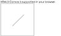
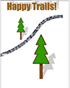
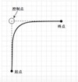

# HTML5 Canvas注意项

##1. 检测浏览器支持情况
在创建 HTML5 canvas 元素之前，首先要确保浏览器能够支持它。如果不支持，你就要为 那些古董级浏览器提供一些替代文字。
```
try {
        document.createElement("canvas").getContext("2d");
        document.getElementById("support").innerHTML =
            "HTML5 Canvas is supported in your browser.";

    } catch (e) {
        document.getElementById("support").innerHTML = "HTML5 Canvas is not supported";
    }
```


##2.在页面中加入 canvas

```
<canvas id="diagonal" width="300" height="300">
</canvas>
```
以上代码会在页面上显示出一块300×300像素的“ 隐藏” 区域。假如要为其增加一个边框， 可以像下面代码 代码一样，用标准 CSS 边框属性来设置。
```
<canvas id="diagonal" style="border: 1px solid;" width="300" height="300">
</canvas>
```
####2.1 Demon

####2.1.1在 canvas 中绘制一条对角线
```
function drawDiagonal() {
        // 取得 canvas 元素及其绘图上下文
        var canvas =document.getElementById('diagonal');
        var context = canvas.getContext('2d');
        context.moveTo(70, 140);
        //用绝对坐标来创建一条路径 context.beginPath();
        context.lineTo(140, 70);
        // 将这条线绘制到 canvas 上
         context.stroke();
    }
    window.addEventListener("load", drawDiagonal, true);
```

以上代码有三行点是固定的
``var canvas =document.getElementById('diagonal');
var context = canvas.getContext('2d');// code... context.stroke();``

!首先通过引用特定的 canvas ID 值来获取对 canvas 对象的访问权。这段代码中 ID 就是 diagonal。接着定义一个 context 变量，调用 canvas 对象的 getContext 方法，并传入希望使 用的 canvas 类型。代码清单中通过传入“ 2d” 来获取一个二维上下文，这也是到目前为止唯一 可用的上下文。接下来，基于这个上下文执行画线的操作。在代码清单中，调用了三个方法——beginPath、 moveTo 和 lineTo，传入了这条线的起点和终点的坐标。
方法 moveTo 和 lineTo 实际上并不画线，而是在结束 canvas 操作的时候，通过调用context.stroke()方法完成线条的绘制。

####2.1.2在 canvas 中绘制树林


---
```
function drawTrails() {
        var canvas = document.getElementById('trails');
        var context = canvas.getContext('2d');
        context.save();
        context.translate(130, 250);
        drawTree(context);
        context.restore();

        // 在(260,500)的位置绘制第二棵树
        context.save();
        context.translate(260,500);
        context.scale(2.0,2.0);// 将第二棵树的宽高分别放大至原来的2倍
        drawTree(context);
        context.restore();

        // 小路
        context.save();
        context.translate(-10,350);
        context.beginPath();
        context.moveTo(0,0);
        context.quadraticCurveTo(170,-50,260,-190);
        context.quadraticCurveTo(310, -250, 410,-250);
        gravelImage(context);
        context.restore();

        // 文本
        context.save();
        context.font = "60px impact";
        context.fillStyle = '#996600';
        context.textAlign = 'center';
        // 文本阴影
        context.shadowColor = 'rgba(0, 0, 0, 0.2)';
        context.shadowOffsetX = 15;
        context.shadowOffsetY = -10;
        context.shadowBlur = 2;
        context.fillText('Happy Trails!', 200, 60, 400);
        context.restore();
    }

     // 创建树对象绘制函数，以便重用
    function drawTree(context) {
        // 树干阴影
        context.save();
        context.transform(1, 0, -0.5, 1, 0, 0);
        context.scale(1, 0.6);
        context.fillStyle = 'rgba(0, 0, 0, 0.2)';
        context.fillRect(-5, -50, 10, 50);
        // 使用已有的阴影效果重新绘制树
        createCanopyPath(context);
        context.fill();
        context.restore();

        // 左右渐变色
        var trunkGradient = context.createLinearGradient(-5, -50, 5, -50);
        trunkGradient.addColorStop(0, '#663300');
        trunkGradient.addColorStop(0.4, '#996600');
        trunkGradient.addColorStop(1, '#552200');
        context.fillStyle = trunkGradient;
        context.fillRect(-5, -50, 10, 50);

        // 上下渐变色
        var canopyShadow = context.createLinearGradient(0, -50, 0, 0);
        canopyShadow.addColorStop(0, 'rgba(0, 0, 0, 0.5)');
        canopyShadow.addColorStop(0.2, 'rgba(0, 0, 0, 0.0)');
        context.fillStyle = canopyShadow;
        context.fillRect(-5, -50, 10, 50);

        // 树冠
        createCanopyPath(context);
        context.lineWidth = 4;
        context.lineJoin = 'round';
        context.strokeStyle = '#663300';
        context.stroke();
        context.fillStyle = '#339900';
        context.fill();
    }

     // 绘制树冠
    function createCanopyPath(context) {
        context.beginPath();

        context.moveTo(-25, -50);
        context.lineTo(-10, -80);
        context.lineTo(-20, -80);
        context.lineTo(-5, -110);
        context.lineTo(-15, -110);

        // 树的顶点
        context.lineTo(0, -140);
        context.lineTo(15, -110);
        context.lineTo(5, -110);
        context.lineTo(20, -80);
        context.lineTo(10, -80);
        context.lineTo(25, -50);

        // 连接起点，闭合路径
        context.closePath();
    }

    // 用背景图替代棕色粗线条
    function gravelImage(context) {
        context.strokeStyle = context.createPattern(gravel, 'repeat');
        context.lineWidth = 20;
        context.stroke();
    }
```
##3.知识点简述
####3.1 描边样式
    context.lineWidth = 4;// 加宽线条
    context.lineJoin = 'round';// 平滑路径的接合点
    context.strokeStyle = '#663300';// 将线条颜色改成棕色
    context.lineCap = square;// 线条末端的样式

####3.2 填充样式
    context.fillStyle = '#339900';// 填充色
    context.fill();// 填充闭合路径内的区域
    context.fillRect(-5, -50, 10, 50);// 填充矩形区域
    context.strokeRect// 基于给出的位置和坐标画出矩形的轮廓
    context.clearRect // 清除矩形区域内的所有 内容并将它恢复到初始状态，即透明色

######*注意fill()和stroke()的先后顺序，导致不同的覆盖效果，使用时注意*
####3.3 曲线
    context.quadraticCurveTo(170, -50, 260, -190)// 起点是当前坐标,第一组代表控制点(control point),第二组是指曲线的终点
    其他曲线功能还涉及 bezierCurveTo、arcTo 和 arc 函数
 
####3.4 Canvas 中插入图片
    var img = new Image();
    img.src = "1.jpg";
    // 图片加载完成后，将其显示在canvas上
    img.onload = function () {
      // 在此加载打水印函数
      ...
    }
    // 用图片填充矩形区域内
    context.drawImage(bark, -15, -100, 30, 100);

####3.5 Canvas 渐变
    1.创建渐变对象;
    var canopyShadow = context.createLinearGradient(0, -50, 0, 0);
    2.为渐变对象设置颜色，指明过渡方式;
    canopyShadow.addColorStop(0, 'rgba(0, 0, 0, 0.5)');
    canopyShadow.addColorStop(0.2, 'rgba(0, 0.4, 0, 0.0)');
    canopyShadow.addColorStop(0.4, 'rgba(0, 0.8, 0, 0.0)');
    canopyShadow.addColorStop(1.0, 'rgba(0, 0.9, 0, 0.0)');
    3.在 context 上为填充样式或者描边样式设置渐变。
    context.fillStyle = canopyShadow;           context.fillRect(-5, -50, 10, 50);

    使用放射性渐变的示例
    createRadialGradient(x0, y0, r0, x1, y1, r1)
    前三个参数代表以(x0,y0)为圆心，r0 为半径的圆，后三个参数代表以(x1,y1)为圆心， r1 为半径的另一个圆。渐变会在两个圆中间的区域出现。

####3.6 背景图
    // 加载背景图片
    var gravel = new Image();
    gravel.src = "gravel.jpg";
    gravel.onload = function () {
        drawTrails();
    }
    // 用背景图替代粗线条
    context.strokeStyle = context.createPattern(gravel,     'repeat');
    context.lineWidth = 20;
    context.stroke();
####3.7缩放 canvas 对象
    context.save();
    context.translate(260, 500);// 先平移
    context.scale(2, 2);// 再缩放
    drawTree(context);
    context.restore();
####3.8图像旋转
    context.save();
    // 旋转角度参数以弧度为单位
    context.rotate(1.57);
    context.drawImage(myImage, 0, 0, 100, 100);
    context.restore();

####3.9 Canvas 文本
     context 对象的文本绘制功能由两个函数组成:
     fillText(text,x, y,maxwidth)--(必选,必选,必选,可选)
     trokeText(text,x,y,maxwidth)--(必选,必选,必选,可选)

     必选参数包括文本参数以及用于指定文本位置的坐标参数
     maxwidth 是可选参数,用于限制字体大小,它会将文本字体强制收缩到指定尺寸
####3.10 应用阴影
    // 设置文字阴影的颜色为黑色，透明度为20%
    context.shadowColor = 'rgba(0, 0, 0, 0.2)';
    // 将阴影向右移动15px，向上移动10px
    context.shadowOffsetX = 15;
    context.shadowOffsetY = -10;
    // 轻微模糊阴影
    context.shadowBlur = 2;

### 小习惯
```
    var canvas = document.getElementById('trails');
    var context = canvas.getContext('2d');
    context.save();

    // do ohter ...

    context.restore();
```


